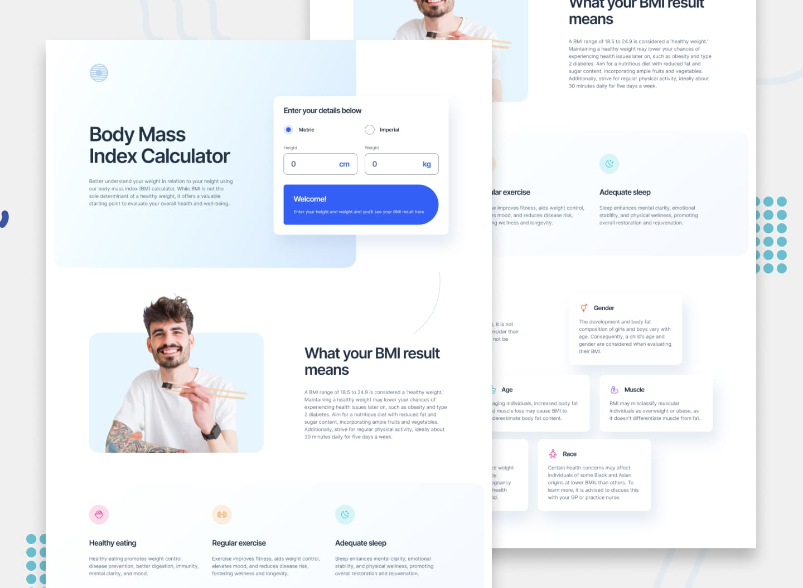

# Frontend Mentor - Body Mass Index Calculator

## Welcome! 👋

Thanks for purchasing this premium Frontend Mentor coding challenge.

[Frontend Mentor](https://www.frontendmentor.io) challenges help you improve your coding skills by building realistic projects. These premium challenges are perfect portfolio pieces, so please feel free to use what you create in your portfolio to show others.

## User Stories 🏷️

- Select whether they want to use metric or imperial units
- Enter their height and weight
- See their BMI result, with their weight classification and healthy weight range
- View the optimal layout for the interface depending on their device's screen size
- See hover and focus states for all interactive elements on the page

Want some support on the challenge? [Join our community](https://www.frontendmentor.io/community) and ask questions in the **#help** channel.

### Expected behaviour

Below you will find the BMI ranges and their weight classifications. Based on the person's BMI results, add their weight classification to the sentence "Your BMI suggests you’re" within the results component.

- Underweight: BMI less than 18.5
- Healthy weight: BMI 18.5 to 24.9
- Overweight: BMI 25 to 29.9
- Obese: BMI 30 or greater

Add the individual's healthy weight range based on the lower and upper BMI categorisations and the person's height.
